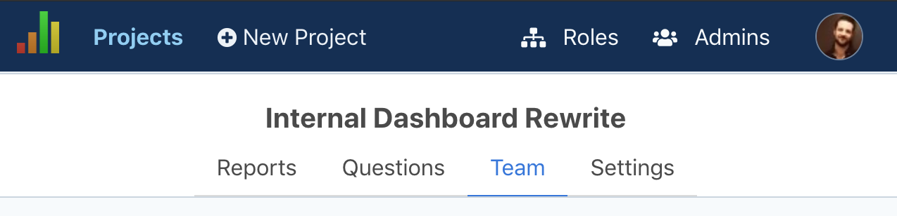

In July, I added new management features for company admins. Before, you had to clunkily add them through a project view, but _now_ they have their own Admins section ✨.

Also, while I was in there, the old nav was bugging me -- it was in a sidebar, and the hierarchy was weird. There's top-level global nav, like Projects, Roles, Admins, plus account-level things like Subscriptions. But within a project, there's the Reports, Questions, Team, and Settings nav items.

Up til now, when you clicked into a project, the project nav would kinda take over and mix into the global sidenav, which felt weird.

Now, there's a two tier top nav, which feels a lot more consistent. Account links are all tucked into a dropdown, and second-level links have a consistent, tab-like structure.

### Here's how it looks now 😍

That's about it! **Next up**, I'm going to work on email updates for admins. I have some ideas to make these useful, by auto-analyzing the patterns and suggesting changes, but the v1 will prob be pretty simple.

I also want to add bi-weekly/monthly survey options (vs just weekly) -- this should be simple, so may come first.

**If you haven't yet, please check out [ProjectPoll](https://projectpoll.co)!** I'd love to know how it's working for your teams.