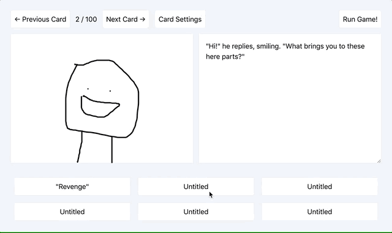

Some would say that if you're going to create public artifacts, like side projects or video streams, they should be the _best things you can do_, since you'll be judged on them forever.

Some would also say you should _practice_ before you publish, that you should hone your technique, charisma, and typing speed before you unleash a video of yourself programming upon the unsuspecting public.

Nah.

Here's my first ever recorded programming session, writing terrible code, getting stuck on silly things, thinking as little as possible. Twas fun 💙 (more backstory below 👇).

* YouTube: [https://youtu.be/WL4uMThO81w](https://youtu.be/WL4uMThO81w)
* Repo: https://github.com/tc4mpbell/react-gamemaker

`video: https://youtu.be/WL4uMThO81w`
`video: https://youtu.be/HGaadqu5dnY`

<!--  -->

### Backstory, fwiw
When I was ~11, on a black-and-white Mac laptop (running, like, System 7), browsing AOL on our $-per-minute internet service, I found GameMaker. It's a super simple, card-based game creation tool.

I spent the next few years hanging out on its AOL discussion group, mostly chatting, sometimes making games, learning HTML/CSS/PHP to make _websites_ for said games. 

There's a straight line between this early black-and-white GameMaker app and my being a programmer today.

So today, I started to recreate it in its simplest form. GM got more features over the years -- sprites and scripting and such -- but I still love the constraints of that first version, where all you had was buttons and cards and text.

---

My kids have been really into [code.org](https://code.org) recently. They've been using App Lab to make little quiz/choose-your-own-adventure apps. Feels like they're starting to experience some of the same joy of creation that I found when I was a kid, and I love that. 

I don't know if they'll be coders. But I hope they'll be creators. And if they do want to get into coding, it's exciting that I can hopefully help smooth the annoying bits, and guide them toward the awesome creative parts.

Anyway -- despite the dreadful sound and marginal code quality and lack of witty chatter, I think *they* might be interested in these videos. So that's my audience -- my 8 and 6 yr old. Sorry to inflict it on the rest of you 🤗.