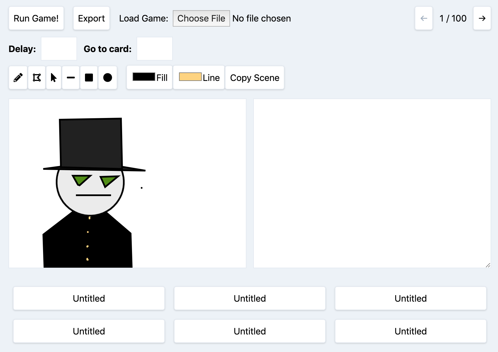

### A break from ProjectPoll

I took a break from working on ProjectPoll for the fall. Enjoyed hacking on my game builder and doing non-businessy things instead.

I'll get back to it! Stepping back was valuable -- I have a clearer idea of what I want it to be someday.

### Game-builder-thing

In September, I worked quite a bit more on my React card game-making tool (https://github.com/tc4mpbell/react-gamemaker). Refactored/split up components to a saner structure, moved state to Redux, added a polygon tool, etc. There are some bugs outstanding, but a bit more "polish". 

**Some ideas on what to do next:**

* Fix import/export: I haven't updated this since I moved the state to Redux. I need to add in a way to serialize/deserialize this.
* Ability to save/share/publish games in the cloud: I'd like people to be able to save their in-progress games, and see/play those of other people.
* Replace drawing tools with paint tools: I think I just want bitmap painting tools instead of this SVG-based library. Not sure if there's an off-the-shelf library I can drop in, or if I need to build them myself.
* Preset palette of colors from which to select.

### Travel

We drove up to New Hampshire at the beginning of October for a long weekend (Friday-Monday). Visited old friends, conversed enthusiastically about life, community, theology, work, and whatever else came to mind. 

The kids did great on the 10 hour drive. They read and drew and listened to audiobooks. I think Imogen's on her 3rd time through the full Harry Potter series, a choice of which I _strongly approve_.

I want to do more traveling. We've made some tradeoffs/optimizations that make it easy (renting, homeschooling), and the kids seem the right age to enjoy and remember it. 

### General

Life only speeds up. This is fine, I'm quite enjoying it, but it does feel like the "default" activities, the ones we're already involved in and committed to, will happily expand to fill all the time, if allowed. If I want to pursue new goals or make new habits, will need to be done purposefully. 

**Todo**: Skeptically evaluate our default activities. Are they still serving us well? Do the same with anything new we add. It's easy to accrete commitment, harder to disentangle.