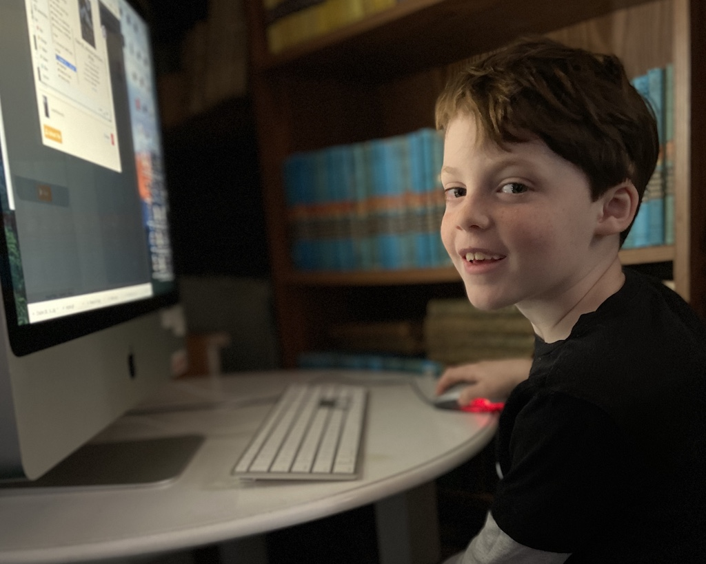
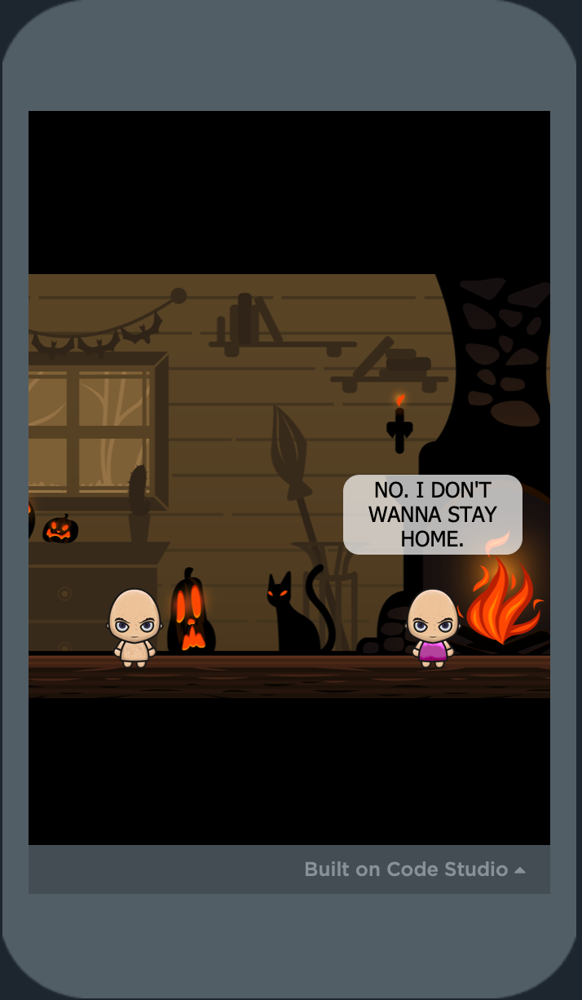
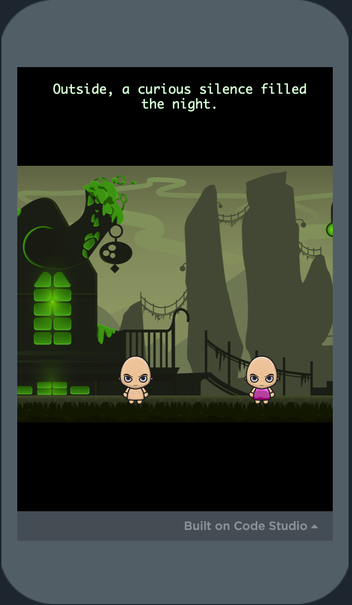
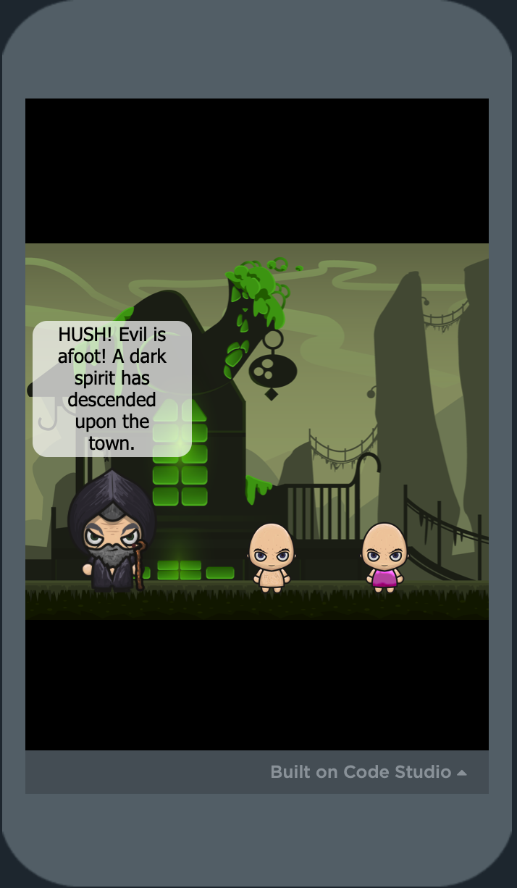
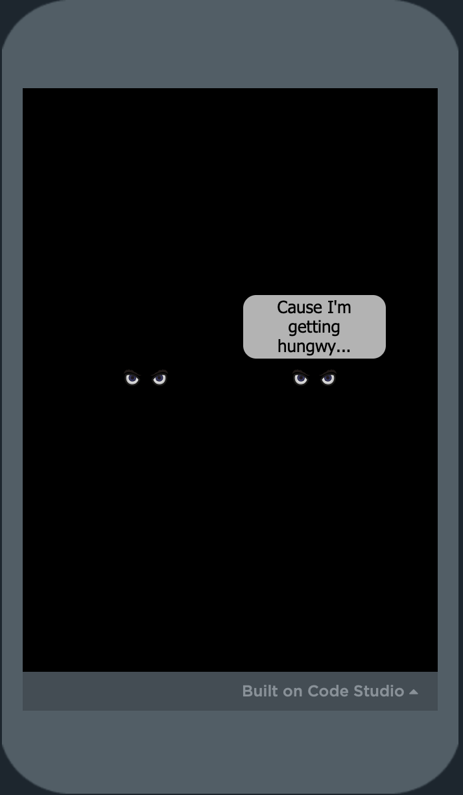

## Backstory

Ira and Imogen are both into [Code.org](https://code.org). They drag blocks around in App Lab, making Choose Your Own Adventure-esque games. As I type, Ira's at the table next to me, working on his Nightmare Before Christmas game.



I spent a few hours in November making an App Lab game for Ira's birthday. I left my job last week (a separate post :)), so didn't "finish" it in the midst of trying to wrap up work projects, but got the basics of the engine done and some content.

The epic and imaginative plot is based on a series of stories I've been telling them for a few years, starring Princess Imogen and Prince Ira, a pair of poorly-behaved babies who live in a castle and have a magical aunt. They also talk in baby voices, which is pretty much the best part. The game faithfully recreates this in text form.

## Making of

I started building it in the block editor, but quickly switched to the raw Javascript view to move faster. I used App Lab scenes to structure the game, and still used only the functions they offer. It ended up with ~600 lines of Javascript code.

The assets (backgrounds and characters) were from the free collection on [CraftPix](https://craftpix.net/freebies/free-halloween-2d-game-backgrounds/).

To build the scenes, I wrote some helper functions for things like navigating between screens, drawing characters, adding speech bubbles, etc.

These handle drawing backgrounds and characters, and moving the assets between screens so I didn't have to redraw the characters on each screen.

I used a semi-undocumented `setParent` function to help with this -- this seems key for any games of this sort that want to reuse assets between screens.

Each scene can have movement and conversation. All in-scene changes are done in the same way:

- When you enter a scene, I reset a `state` counter to 0.

- When you click anywhere on screen, I increment the counter.

- When you click a button, I typically switch the scene OR set the counter to a relevant amount.

Based on this `state`, I show the appropriate text. So the scripting for a scene looks like this:

```javascript
function outsideBasement(state) {
  setParent('img-wizard-exterior', screen)
  draw('immy', 198, 265)
  draw('ira', 70, 265)

  if (state == 0) {
    setStyle('img-wizard-exterior', 'object-position: left;')

    screenText(
      'The children unlock the door, clamber up the stairs and tumble out into the weird green night.'
    )
  } else if (state == 1) {
    screenText()
    say('immy', 'This Hawwoween is vewy bad.')
  } else if (state == 2) {
    say('immy')
    say('ira', "We haven't gotten no candy yet. And our house has disappeawed.")

    action(1, 'Go right', function() {
      setStyle('img-wizard-exterior', 'object-position: right;')

      action(1, 'Go back to the castle', function() {
        go('4-outside-castle', outsideCastle)
      })
    })
  }
}
```

The `action()` function creates buttons on the bottom of the screen, with a callback function that executes when it's clicked.

As the Shakespearian dialogue unfolds, you can see how the logic of the scene is just based on the state number. This is incremented whenever you click the screen, so you'll usually click through some text, then get to a state that sets the action buttons.

Once set, the action buttons don't disappear unless they're explicitly cleared, so I don't have to maintain them in each state if I want them to hang out while other things happen.

## Unfinished product

Here's a link, if you want to ~~explore the barely working hack code and childish jokes~~ experience the epic journey for yourself: https://studio.code.org/projects/applab/_c33TaOew-29bcl5Mw0MCg9fdmfGzOKf6g5uirigvLg

It ends abruptly after they catch the spider (i.e. the buttons just stop working -- maybe I'll add an ending screen soon.)

<div style='width:150px; float:left;'>
    
</div>
<div style='width:150px; float:left;'>
    
</div>
<div style='width:150px; float:left;'>
    
</div>
<div style='width:150px; float:left;'>
    
</div>
<br clear='both' />

## What's next

I had just decided to add inventory -- the spider is a test of that. This will let me add Real Puzzles.

I also had the idea to add a map screen for easier navigation between the parts of the world. Since I'm using these free backgrounds, I kinda build the game around them, but there's not a great way to transition between Halloween Exterior and Sunny Beach -- the map would help with this, since I wouldn't need to show the intermediate travel steps.

## What's _really_ next

If I work up the energy to work on this some more, it'll probably be next year around birthday time. Maybe if I work on it for the next 10 years of birthdays, it'll end up an epic indie masterpiece, discovered after my death and placed properly in the indie game development canon, to be studied forevermore by students of gaming history.
